# Booking Manager

This application enables users to create, read, edit and delete property bookings. The interface is fully responsive and adapts to all screen sizes.

## Instalation

```js
npm install
npm run dev
```

## Architecture

The diagram bellow gives an overview on how the component tree integrates. Currently we have a significant amount of Business Logic across the Model, Controller and View Layers. Limiting this logic to abstract layers would be beneficial for the maintainability and scalability of the application.

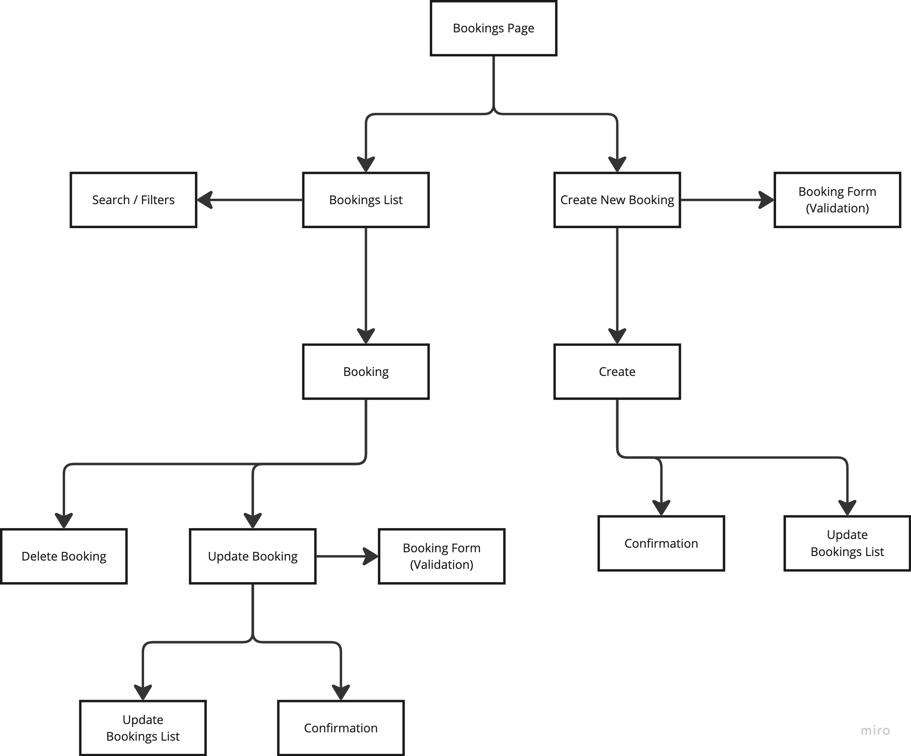

Context Providers are being used as a Global Data Store for Bookings and Properties. The providers integrate with all the component layers and offer data and management actions that automatically synchronizes across the entire application.

| Data Provider                                          | Data Lifecycle                                     |
| ------------------------------------------------------ | -------------------------------------------------- |
| 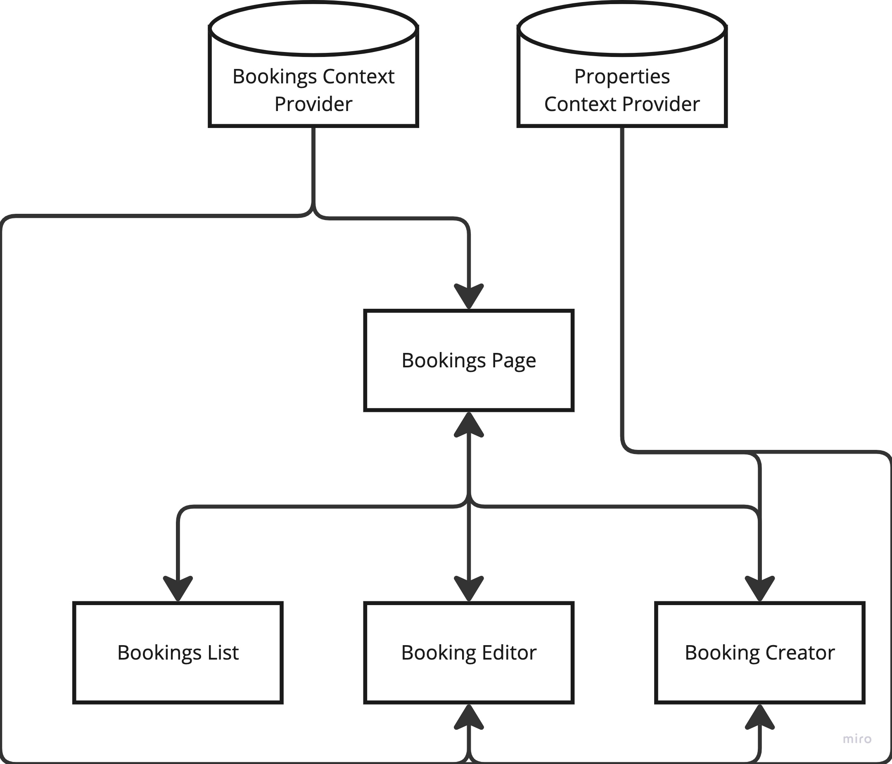 | 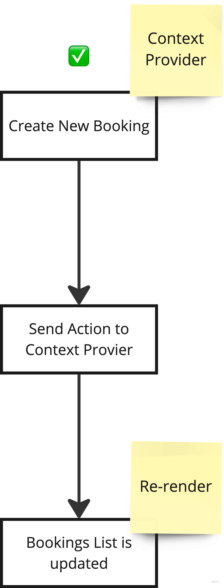 |

## Technologies

- This project was created using Vite + SWC as Frontend Tooling and serving/building engines.
- React was used for rapid interface and state management.
- TypeScript was used for safe data typing.
- TailwindCSS was used for layout structure and styling.

## UX/UI Project

The project consists of a single page where all the management operations can be performed without the need for redirection in order to reduce loading time friction and increase productivity.

### Wireframes

See Wireframes below for reference on idealization concepts:

#### Booking Cretor

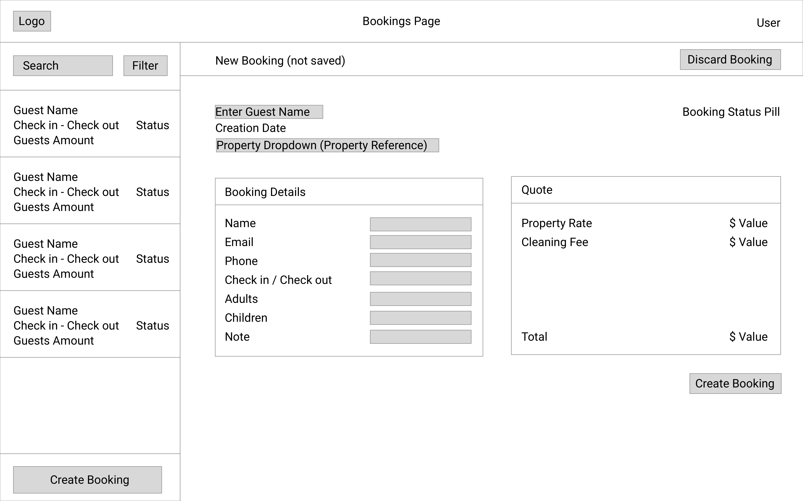

#### Booking Editor

| Mobile                                             | Desktop                                    |
| -------------------------------------------------- | ------------------------------------------ |
| 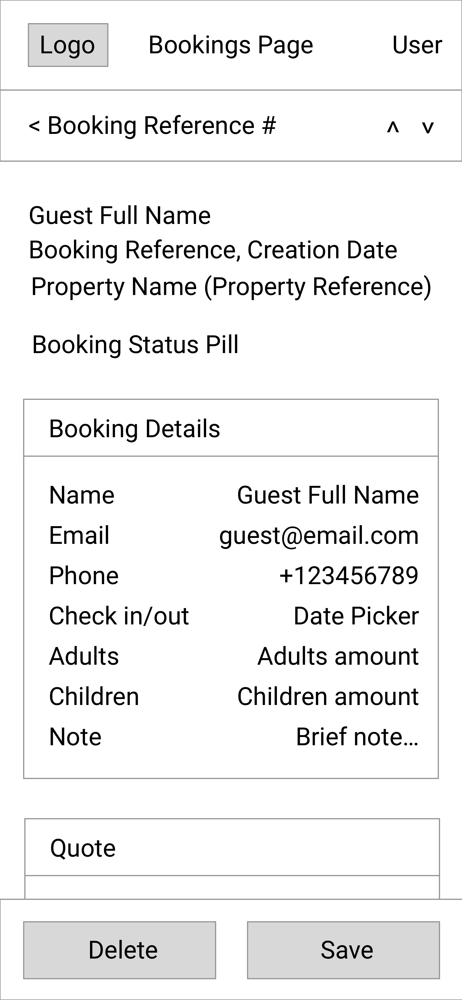 | 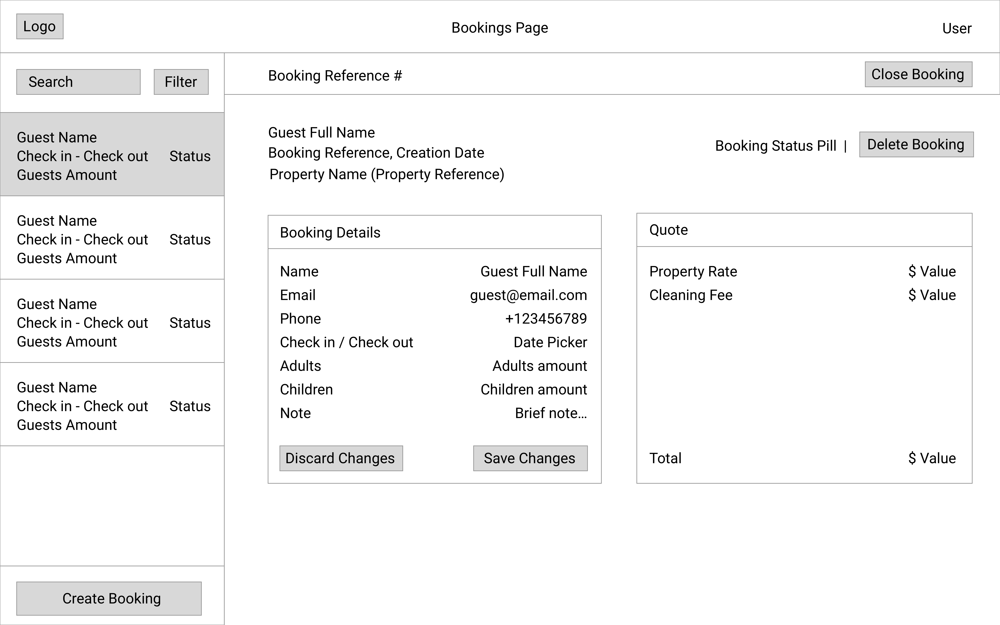 |

#### Bookings List

| Mobile                                           | Desktop                                    |
| ------------------------------------------------ | ------------------------------------------ |
| 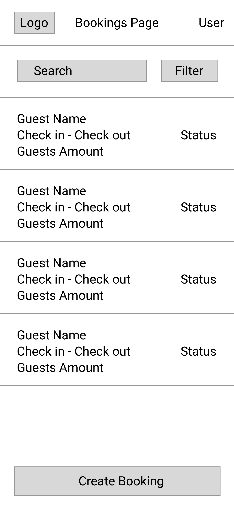 |  |

#### Filtering

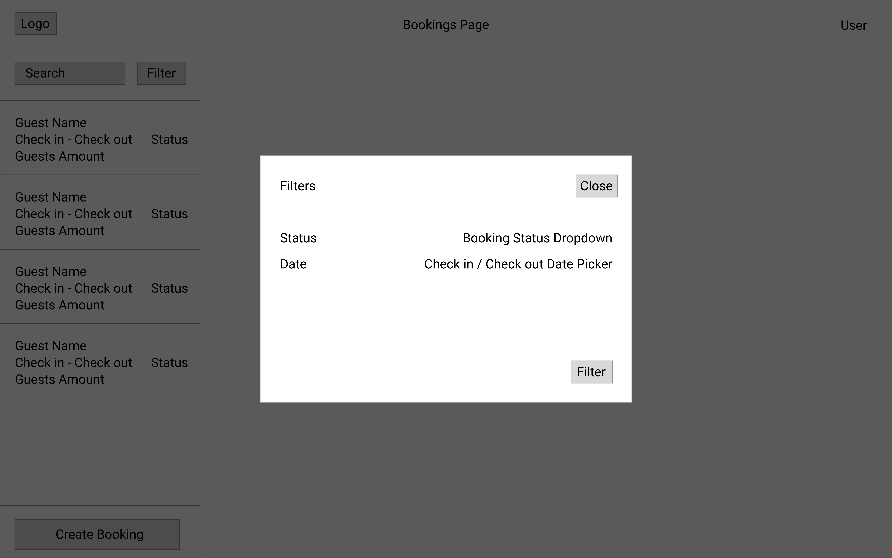

#### Empty State

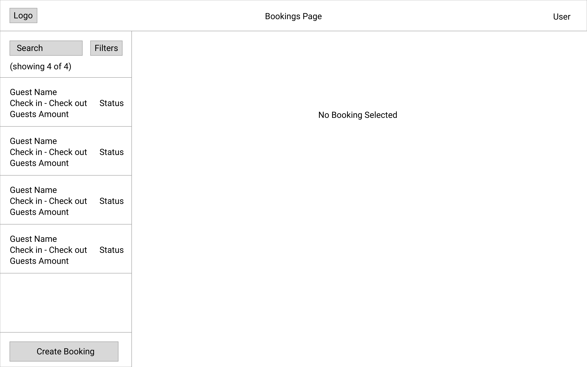

### Screen Shots

See below screen shots taken from the working application:

#### Booking Creator

| Mobile                                                    | Desktop                                                 |
| --------------------------------------------------------- | ------------------------------------------------------- |
| 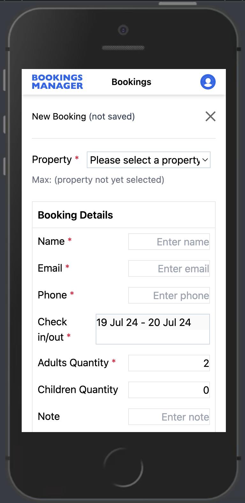 | 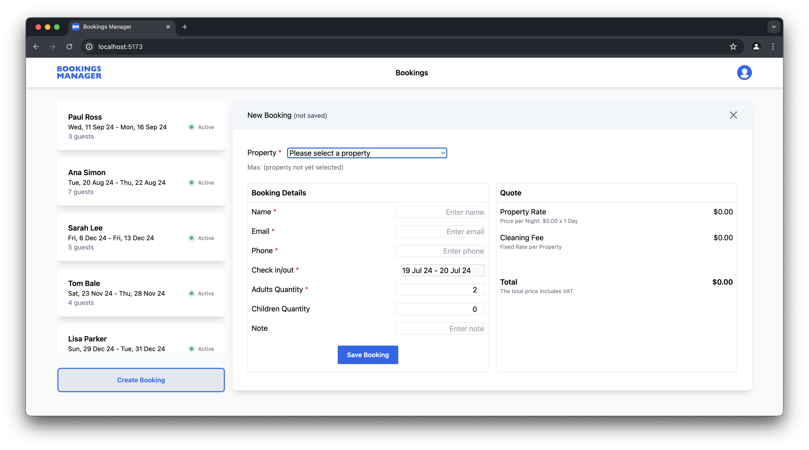 |

#### Booking Editor

| Mobile                                                   | Desktop                                                |
| -------------------------------------------------------- | ------------------------------------------------------ |
| 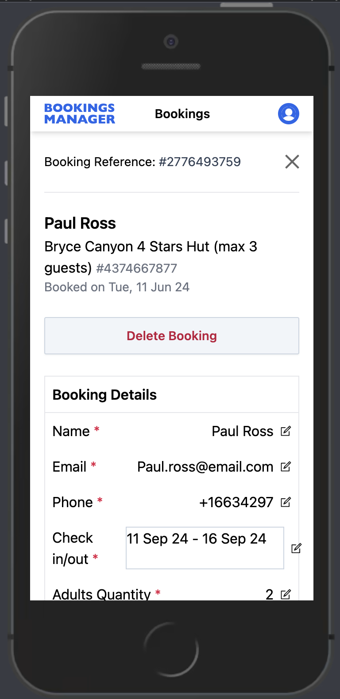 | 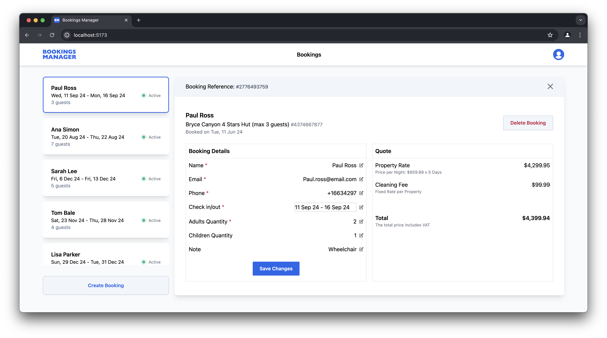 |

#### Booking List

| Mobile                                                 | Desktop                                                |
| ------------------------------------------------------ | ------------------------------------------------------ |
| 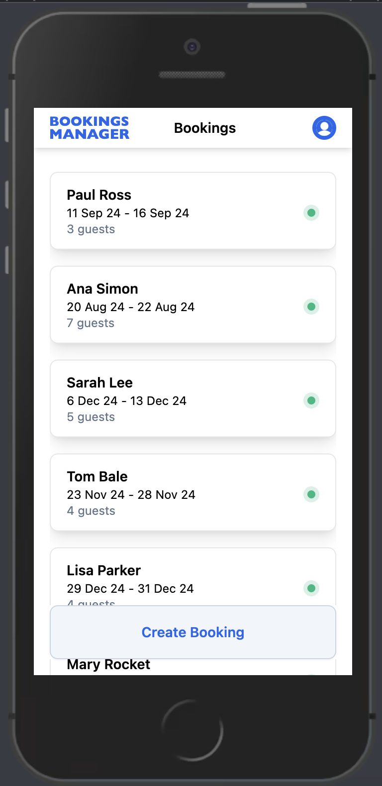 |  |

## Branding

The chosen identity is primarily functional. It enables highlighting core elements on the interface without being misleading or confusing.

- Primary color: `#2563EB`
- Font Family: `Inter Variable`

See some examples of logo usage below:


